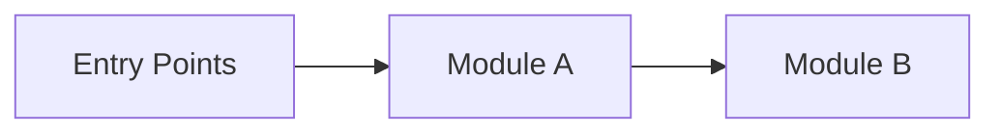

# Architecture Overview

> TEMPLATE ONLY — remove this note and replace all placeholder text before saving as a real `docs/Architecture/Overview.md`.

Goal: in ~5 minutes, understand **what exists**, **where it lives**, and **how modules interact**.

## Summary (keep it short)

- **System:**  
- **Where is the code:**  
- **Entry points:**  
- **Dependencies:**  

## Scoping (read first)

- **In scope:** …
- **Out of scope:** …
- Pick impacted module(s) from the diagram + modules table.
- Pick entry point(s): API / UI / CLI / job / event.
- Read only: linked ADR/Feature doc(s) → entry-point file(s) → minimum dependencies.
- Stop if scope can’t be mapped to this doc → update this doc (or ask 1 clarifying question).

## 2) Module map (Mermaid)

> TEMPLATE ONLY — model modules + boundaries (not every class/file). Add dependencies only if they exist. Remove this note in the real doc.

## 3) Modules (catalog)

| Module | Responsibility | Entry points | Owns data? | Depends on | Notes |
| --- | --- | --- | --- | --- | --- |
| ModuleName | What it does | HTTP / CLI / jobs / events | Yes/No | DB / modules / services | Notes |

## 4) Dependency rules (must be explicit)

- Allowed dependencies:  
- Forbidden dependencies:  
- Integration style: sync calls / events / shared library  
- Shared code policy:  

## 5) Key decisions (ADRs)

- Link ADRs that define boundaries, dependencies, and cross-cutting patterns.  
- Keep this section link-based. Detailed flows belong in feature docs / ADRs, not in the overview.

- `docs/ADR/ADR-XXXX-some-decision.md` — what it decides, and what it impacts

## 6) Where to go next

- Decisions: `docs/ADR/`  
- Behaviour specs: `docs/Features/`  
- How to run + verify: `docs/Development/`, `docs/Testing/`
